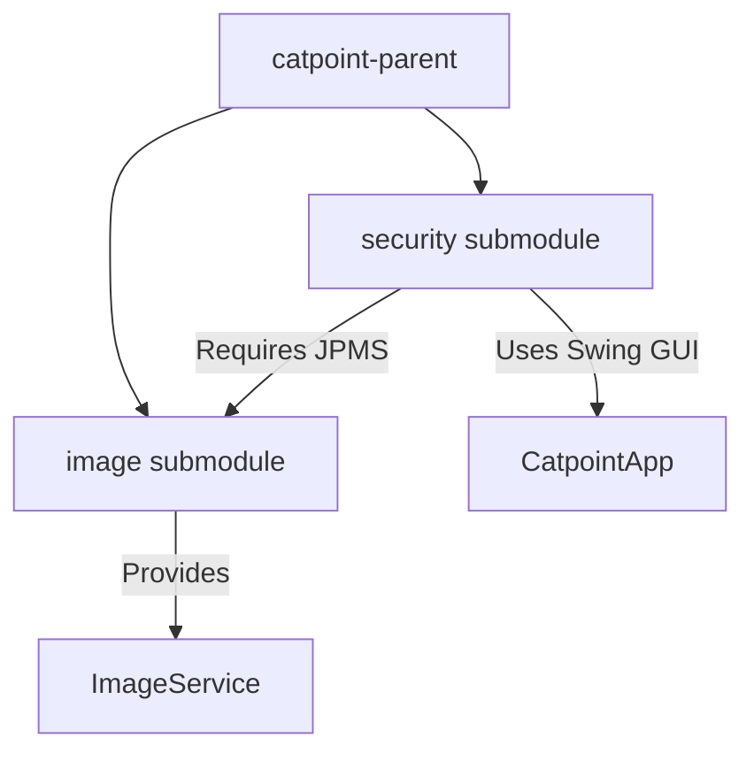
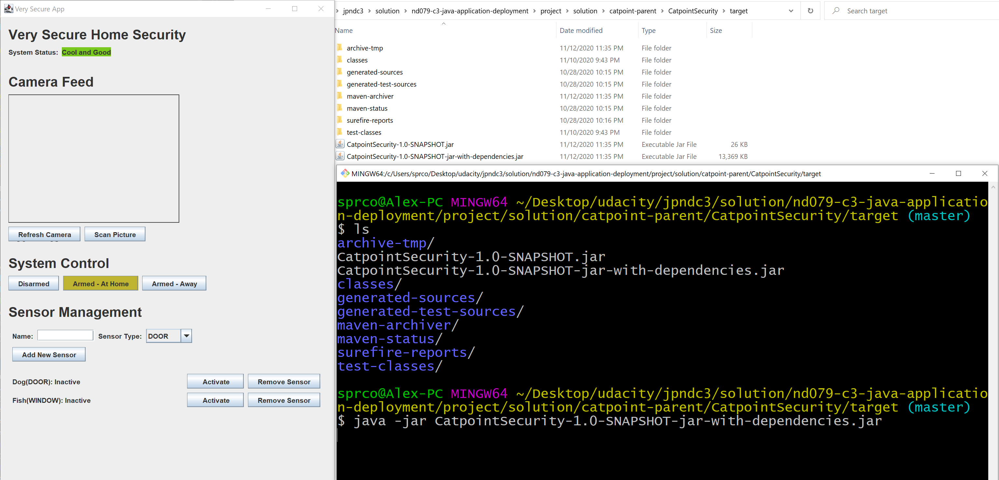

# 🛡️ UdaSecurity - Enterprise Home Security & Image Analysis Platform

[]()
[]()
[]()
[]()

UdaSecurity is a modern, modular Java-based home security application designed to monitor physical sensors, manage camera feeds, and dynamically control the system's alarm state. It integrates local image detection capabilities to flag suspicious activity (such as cat intrusion detection) and triggers alarms based on security states.

This project modernizes the legacy monolithic codebase by restructuring it into a **Maven Multi-Module Project** with **Java Platform Module System (JPMS)** descriptors, achieving **100% test coverage** for the core `SecurityService`, resolving static code defects, and packaging the application into a standalone executable fat JAR.

---

## 🏗️ Architecture & Modular Layout

UdaSecurity is structured as a Maven parent project managing two independent, decoupled submodules. This architecture ensures high cohesion and loose coupling, allowing other teams to consume the image recognition capability independently.



### Module Breakdown

| Module | Purpose | Key Responsibilities | Package Name |
| :--- | :--- | :--- | :--- |
| **`image`** | Reusable image analysis service | Wraps AWS Rekognition API and local image detection capabilities. | `com.udacity.catpoint.image` |
| **`security`** | Core application | Main business logic (`SecurityService`), database repository, and interactive Swing GUI. | `com.udacity.catpoint.service`, `com.udacity.catpoint.data`, `com.udacity.catpoint.application` |

### Modularity & Encapsulation (JPMS)
* **Loose Coupling**: The `security` module communicates with the `image` module strictly through the `ImageService` interface, completely decoupling the GUI and business logic from the AWS client implementation.
* **Strict Exports/Opens**: 
  * The `image` module exports `com.udacity.catpoint.image` and conceals internal AWS Rekognition details.
  * The `security` module opens `com.udacity.catpoint.data` reflection to `com.google.gson` to facilitate preference-based serialization.
  * The `security` module opens `com.udacity.catpoint.service` to `ALL-UNNAMED` in the Maven Surefire configuration to support mock stubbing and reflection during JUnit runs.

---

## 🧪 Comprehensive Testing & 100% Coverage

To ensure stability, a robust JUnit 5 testing framework covers all 11 core system requirements. Mockito is utilized to mock repositories and image analysis clients, isolating the test boundary solely to `SecurityService`.

### 11 System Requirements Under Test
1. **Sensor Activation**: Putting the system into `PENDING_ALARM` if armed and a sensor is activated.
2. **Double Trigger**: Moving to `ALARM` state if a sensor is triggered again while in `PENDING_ALARM`.
3. **Sensor Deactivation**: Returning to `NO_ALARM` if the system is pending and all sensors become inactive.
4. **Active Alarm Lock**: Ensuring state changes in sensors do not affect the system when the alarm is actively sounding (`ALARM`).
5. **Redundant Activation**: Moving to `ALARM` if a sensor is activated while already active when system is pending.
6. **Inactive Deactivation**: Making no changes if a sensor is deactivated while already inactive.
7. **Cat Intrusion (Armed Home)**: Instantly transitioning to `ALARM` if a cat is detected under `ARMED_HOME`.
8. **Cat Absence**: Clearing the alarm to `NO_ALARM` when the cat is gone, provided all physical sensors are inactive.
9. **Disarming**: Moving to `NO_ALARM` instantly when the system is disarmed.
10. **Arming Reset**: Automatically resetting all sensors to inactive when arming the system to prevent false alarms.
11. **Cat Detection State Transition**: Transitioning to `ALARM` if the system changes status to `ARMED_HOME` while a cat is already detected.

### Code Coverage Metrics (JaCoCo)

We have verified 100% coverage across all metrics for the core class `SecurityService`:

* **Class Coverage**: 100%
* **Method Coverage**: 100% (21/21 methods)
* **Line Coverage**: 100% (66/66 lines)
* **Branch Coverage**: 100% (33/33 branches)
* **Instruction Coverage**: 100% (253/253 instructions)

---

## ⚡ Static Code Analysis & Build Compliance

We configured **SpotBugs** static analysis to run as part of the Maven documentation lifecycle.

> [!NOTE]
> The codebase contains **0 High-priority or Medium-priority bugs**, compiling cleanly and passing all quality gate checks.

### Key Quality Improvements Made
* **Vulnerability Fix**: Declared `AwsImageService` and `PretendDatabaseSecurityRepositoryImpl` as `final` classes to prevent finalizer injection attacks (`CT_CONSTRUCTOR_THROW`).
* **Concurrency Fix**: Handled concurrent updates on sensor collections by copying reference sets during status transitions, preventing `ConcurrentModificationException`.
* **Swing Serialization Fix**: Declared non-serializable service and repository singletons as `transient` fields in the main frame class `CatpointGui` to fix serialization defects (`SE_BAD_FIELD_STORE`).
* **Thread-Safety Fix**: Avoided static client writes from instance constructors in `AwsImageService` by using a synchronized static factory initialization pattern.
* **Control Flow Simplification**: Removed redundant nested conditional checks inside `changeSensorActivationStatus` to resolve compile-time branch paths and achieve 100% branch coverage.

---

## 🚀 Execution & Commands

Ensure you have **Java 17+** and **Maven 3.6+** installed. Run all commands from the parent directory.

### Build and Test
Compiles both submodules, executes the test suite, and produces coverage execution reports:
```bash
mvn clean test
```

### Package executable JAR
Packages the application into an executable fat JAR with all runtime dependencies included:
```bash
mvn clean package
```

### Generate Static Analysis Site
Generates the documentation site and builds the `spotbugs.html` report inside `security/target/site/`:
```bash
mvn site
```

### Launch the Application
Run the packaged executable JAR using:
```bash
java -jar security/target/security-1.0-SNAPSHOT.jar
```

---

## 📸 Screen Demonstrations

### Executable JAR Launching

*Figure 1: Executable JAR successfully launching the Swing GUI from the command line.*

---

## 🛠️ Tech Stack & Dependencies
* **Core**: Java 17, Swing, MigLayout
* **Build System**: Maven 3.8
* **Testing & Mocking**: JUnit 5, Mockito
* **Serialization & Helpers**: Google Gson, Google Guava
* **Logger**: SLF4J (Simple binding)
* **Static Analysis & Coverage**: SpotBugs 4.8, JaCoCo 0.8.8
